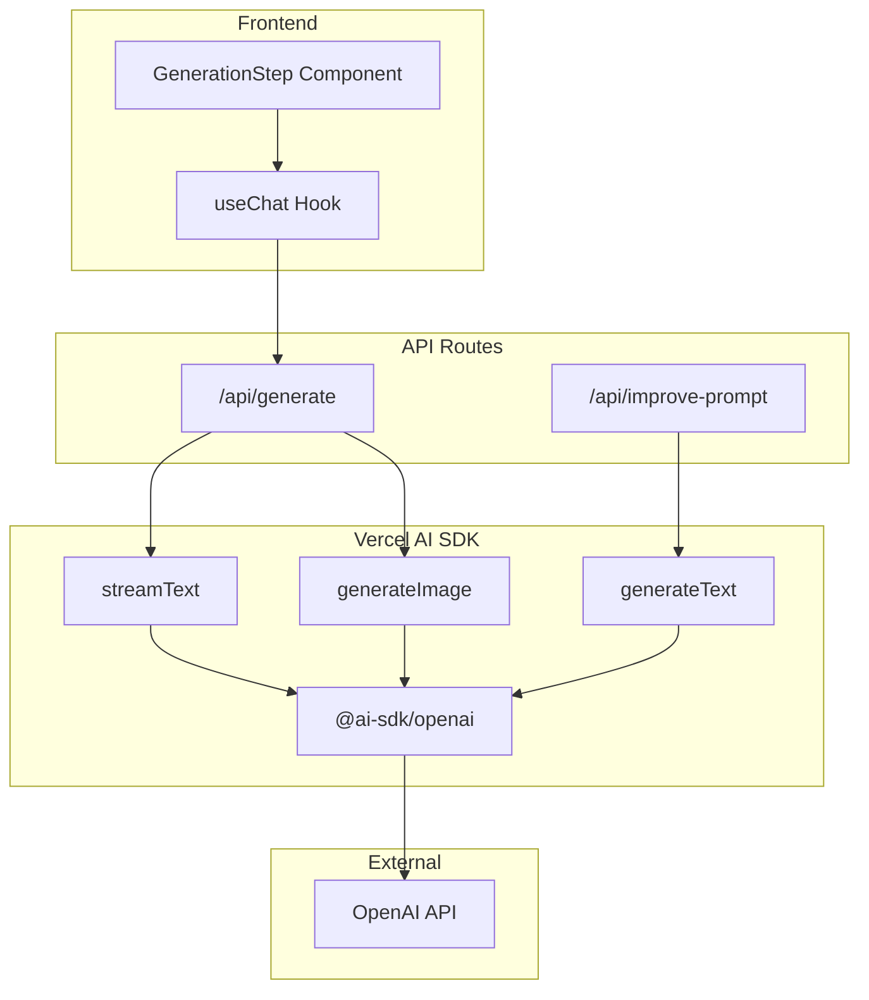

# План рефакторинга: переход на Vercel AI SDK

## Текущее состояние

Проект использует прямые `fetch` запросы к OpenAI API:

- `[app/api/generate/route.ts](app/api/generate/route.ts)` - основная генерация текста/изображений (~1044 строки)
- `[app/api/improve-prompt/route.ts](app/api/improve-prompt/route.ts)` - улучшение промптов (~132 строки)
- `[components/generation-step.tsx](components/generation-step.tsx)` - клиентский компонент генерации

## Архитектура после рефакторинга




---

## Этап 1: Установка и конфигурация OpenAI провайдера

Установить пакет `@ai-sdk/openai` (провайдер для AI SDK):

```bash
pnpm add @ai-sdk/openai
```

Создать файл конфигурации провайдера `lib/ai/openai.ts`:

```typescript
import { createOpenAI } from '@ai-sdk/openai'

export const openai = createOpenAI({
  apiKey: process.env.OPENAI_API_KEY,
})
```

---

## Этап 2: Рефакторинг improve-prompt (простой роут)

Файл: `[app/api/improve-prompt/route.ts](app/api/improve-prompt/route.ts)`

Заменить ручной fetch на `generateText`:

```typescript
import { generateText } from 'ai'
import { openai } from '@/lib/ai/openai'

const { text } = await generateText({
  model: openai(textModel),
  system: IMPROVE_SYSTEM_PROMPT,
  prompt: userPrompt,
})
```

Это уменьшит код с ~130 строк до ~50 строк и уберет ручную обработку ошибок.

---

## Этап 3: Рефакторинг generate (основной роут)

Файл: `[app/api/generate/route.ts](app/api/generate/route.ts)`

### 3.1 Текстовая генерация со стримингом

Заменить `callOpenAiChat` на `streamText`:

```typescript
import { streamText } from 'ai'

const result = streamText({
  model: openai(textModel),
  system: textSystemPrompt,
  messages: [{ role: 'user', content: userContent }], // поддержка multimodal
})

return result.toDataStreamResponse()
```

### 3.2 Генерация изображений

Заменить fetch к `/v1/images/generations` на `generateImage`:

```typescript
import { generateImage } from 'ai'

const { image } = await generateImage({
  model: openai.image(imageModel),
  prompt: compressedPrompt,
  size: '1024x1024',
})
```

### 3.3 Multimodal (изображения из базы знаний)

AI SDK нативно поддерживает multimodal через content массив:

```typescript
const userContent = [
  { type: 'text', text: userMessage },
  ...knowledgeBaseImages.map(img => ({
    type: 'image',
    image: `data:${img.mimeType};base64,${img.base64}`,
  })),
]
```

---

## Этап 4: Обновление фронтенда для стриминга

Файл: `[components/generation-step.tsx](components/generation-step.tsx)`

Заменить ручной fetch на хук `useChat` из `@ai-sdk/react`:

```typescript
import { useChat } from '@ai-sdk/react'

const { messages, isLoading, error, append } = useChat({
  api: '/api/generate',
  body: { formId, customFields },
})
```

Это позволит:

- Показывать текст по мере генерации (стриминг)
- Автоматически обрабатывать состояния загрузки и ошибок
- Упростить код компонента

---

## Этап 5: Удаление неиспользуемых зависимостей

После рефакторинга удалить прямую зависимость `openai`:

```bash
pnpm remove openai
```

Пакет `ai` уже установлен в проекте (версия `^4.0.0`).

---

## Ожидаемые результаты

| Метрика | До | После |

|---------|-----|-------|

| Строк кода в generate/route.ts | ~1044 | ~600 |

| Строк кода в improve-prompt/route.ts | ~132 | ~50 |

| Ручная обработка ошибок fetch | Да | Нет (SDK) |

| Стриминг ответов | Нет | Да |

| Типизация ответов API | Частичная | Полная |

| Поддержка других провайдеров | Нет | Да (легко переключить) |

---

## Риски и ограничения

1. **Image Edit API**: AI SDK `generateImage` поддерживает редактирование через `prompt.images` и `prompt.mask`, но синтаксис отличается от текущего. Потребуется адаптация.
2. **CORS**: Текущие CORS заголовки нужно сохранить, т.к. форма может встраиваться на внешние сайты.
3. **Совместимость моделей**: Динамический выбор модели из БД (`getTextModel()`) требует передачи строки в `openai(modelName)`.

